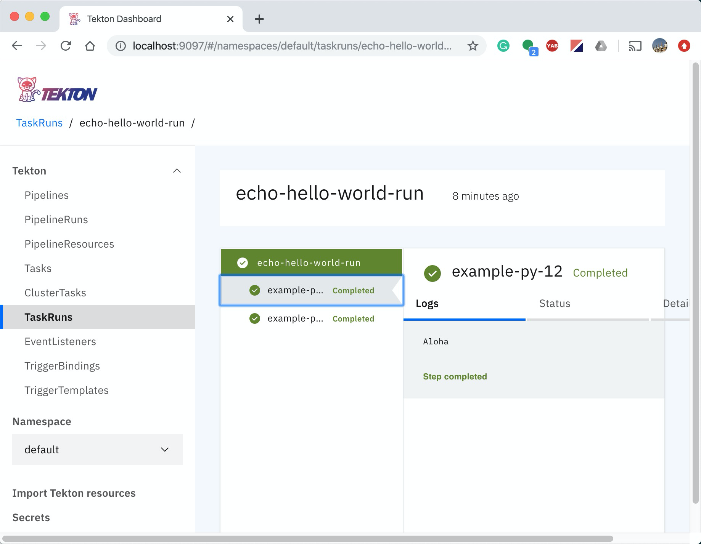

# Fluid: A Tutorial

This tutorial shows you how to write a Fluid program, convert it into a Tekton workflow, and run it on a Kubernetes cluster on your computer.

## Setup Minikube and Tekton

1. Install Minikube on macOS.
   
   ```bash
   brew install minikube
   minikube start
   ```
      
   If you are not using macOS, please follow this [tutorial](https://kubernetes.io/docs/tasks/tools/install-minikube/).  After a successful installation, you can check the nodes (VM) running Minikube using the command `kubectl get nodes`.

1. Install Tekton.
   
   ```bash
   kubectl apply --filename https://storage.googleapis.com/tekton-releases/pipeline/latest/release.yaml
   ```
   
   For more details, you can check this [tutorial](https://github.com/tektoncd/pipeline/blob/master/docs/install.md).  You can type the command `   kubectl get pods --namespace tekton-pipelines` to check related Pods are running.

1. Install the Tekton Dashboard (optional).

   ```bash
   kubectl apply --filename https://github.com/tektoncd/dashboard/releases/download/v0.3.0/dashboard-latest-release.yaml
   ```
   
## Install Fluid

To check Fluid from Github, type the following command.

```bash
git clone https://github.com/wangkuiyi/fluid
```

To tell Python where Fluid is, you can set the `PYTHONPATH` environment variable.

```bash
export PYTHONPATH=$PWD/fluid:$PYTHONPATH
```

## Program, Compile and Run

The following `example.py` file defines a Task with two steps and two input parameters and runs the Task.

```
import fluid

@fluid.task
def echo_hello_world(hello, world="El mundo"):
    fluid.step(image="ubuntu", cmd=["echo"], args=[hello])
    fluid.step(image="ubuntu", cmd=["echo"], args=[world])

echo_hello_world("Aloha")
```

To compile it into a Tekton YAML file, run the Python program.

```bash
python example.py > example.yaml
```

The Python function definition of `echo_hello_world` becomes the Task object in `example.yaml`.  The call to `echo_hello_world` becomes a TaskRun object.

To run the `example.yaml` file, type the following command.

```bash
kubectl apply -f example.yaml
```

To check the status, type the `kubectl get tekton-pipelines` command.  You will see some output like the following.

```bash
$ kubectl get tekton-pipelines
NAME                               AGE
task.tekton.dev/echo-hello-world   4m18s

NAME                                      SUCCEEDED   REASON      STARTTIME   COMPLETIONTIME
taskrun.tekton.dev/echo-hello-world-run   True        Succeeded   4m18s       117s
```

The command `tkn taskrun describe echo-hello-world-run` checks details of the TaskRun object.  Type `tkn taskrun logs echo-hello-world-run` to check logs.

```
$ tkn taskrun logs echo-hello-world-run
[example-py-12] Aloha
[example-py-13] El mundo
```

To view the dashboard in a Web browser, you need to map the Tekton Dashboard to a local port using the following command.

```bash
kubectl --namespace tekton-pipelines port-forward svc/tekton-dashboard 9097:9097
```

Then, direct your Web browser to localhost:9097.  You will be able to check all kinds of Kubernetes objects supported by Tekton.

